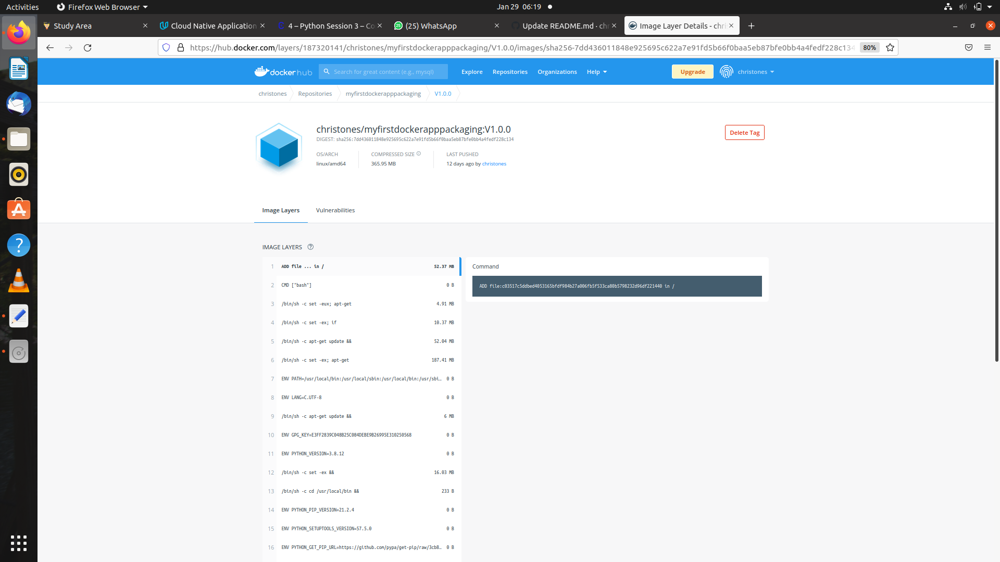

# Dockerpackaging
Packaging a Python Application with Docker
Initially the Python App runned with Flask on a loacalhost deployment.

# INSTALLING DOCKER ( the container management tool ) ON  Ubuntu 20.04 LTS 
 →  sudo apt install docker.io
    
# Coding the Docker File with “Chris Elobo” as LABEL maintainer
 Open Gedit and create the file 'dockerfile'
 The Docker file should contain what follows:
  LABEL maintainer="Chris Elobo"
  COPY . /app
  WORKDIR /app
  RUN pip3 install -r requirements.txt
  CMD [ "python", "app.py" ]

# Building my first DockerImage 
 → sudo docker build -t dockerfile .

 NB: "docker build" requires exactly 1 argument (.) from current directory

 → sudo docker run d -p 5111:5000 dockerfile 
 → sudo docker logs  “generatedlogs”

# Pushing to the Docker registry

 → sudo docker tag dockerfile myfirstdockerapppackaging/python-helloworld:v1.0.0 
                  
 → sudo docker login --username=christones
  Password:**********    /* logging into my dockerhub account, where the repo myfirstdockerapppackaging was created */      

 → sudo docker push myfirstdockerapppackaging/python-helloworld:v1.0.0 
 
 
 

 
 
